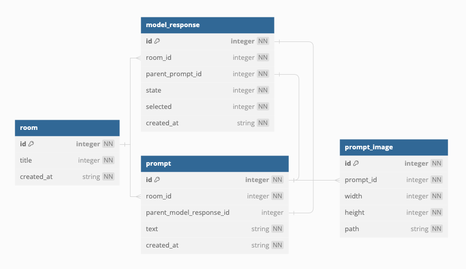

# Gemini Android

| Chat                   | Pick images                          | Select response                              |
|------------------------|--------------------------------------|----------------------------------------------|
|  |  |  |

## How to run?

1. [Create a Gemini API key](https://ai.google.dev/gemini-api/docs/api-key).
2. Create a `secrets.properties` file in a root directory.
3. Setup the API key in the `secrets.properties`.
   ```properties
   GEMINI_API_KEY=YOUR_API_KEY
   ```
4. Build and run the App.

## Features

- Chat with **Gemini AI** using text messages and images.
- Save chat history in the local database using Android Room.
- (Upcoming) Support for Wear OS integration.

## Tech stacks

- 100% Jetpack Compose based + Coroutines + Flow for asynchronous.
- Gemini SDK
- Jetpack
    - Compose
    - ViewModel
    - Hilt
    - Room
- Glide
- Robolectric

## Architecture

Gemini Android follows the
[Google's official architecture guidance](https://developer.android.com/topic/architecture)

## ERD


